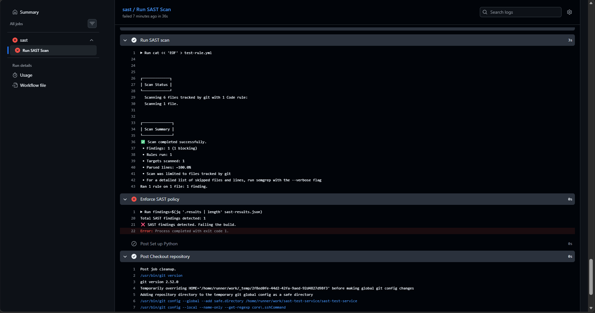

# SAST Implementation – Testing & Validation

## Purpose
This document describes the testing and validation performed to verify the
Infrastructure-Wide SAST Implementation and Standardization.

The objective of testing was to ensure that:
- The reusable SAST workflow functions correctly across repositories
- Static analysis is executed on consumer service code
- Security findings are correctly detected
- CI/CD enforcement blocks insecure code as intended

---

## Test Setup

### Repositories Involved
- **Provider Repository:**  
  `Asterioxer/sast-ci-pipeline-implementation`  
  Contains the reusable GitHub Actions workflow for SAST.

- **Consumer (Test) Repository:**  
  `Asterioxer/sast-test-service`  
  Simulates a backend service consuming the standardized SAST workflow.

---

## Test Methodology

The consumer repository was configured to invoke the reusable SAST workflow
using GitHub Actions. The following validation steps were performed:

1. A backend service workflow was added in the consumer repository using
   the reusable SAST template.
2. Test code containing a deterministic security issue was introduced
   to guarantee detection during static analysis.
3. The SAST workflow was triggered via a repository push.
4. Pipeline logs were reviewed to validate:
   - Scan execution
   - Findings detection
   - Policy-based pipeline failure

---

## Test Case: Deterministic SAST Enforcement

### Scenario
A deterministic Semgrep rule was temporarily used during testing to ensure
that at least one security finding would always be detected. This allowed
reliable validation of policy enforcement behavior.

### Expected Behavior
- SAST scan runs successfully
- Findings are detected in the consumer repository code
- CI/CD pipeline fails due to enforced security policy

### Actual Result
- The SAST scan executed successfully
- One security finding was detected
- The pipeline failed as expected with a non-zero exit code

---

## Evidence

The following GitHub Actions run demonstrates successful SAST execution
and enforcement:

🔗 **GitHub Actions Run (Consumer Repository):**  
https://github.com/Asterioxer/sast-test-service/actions/runs/20964359083/job/60250369289

Key log output observed:
Total SAST findings detected: 1
❌ SAST findings detected. Failing the build.

### Screenshot proof: 
